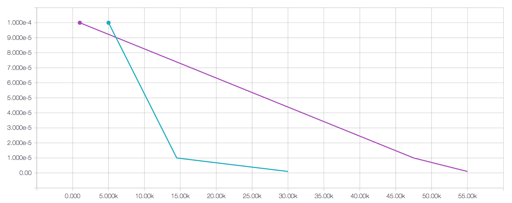
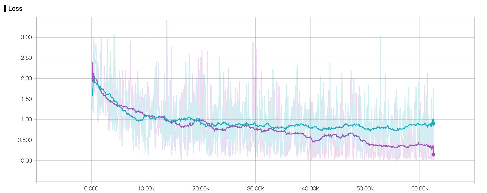
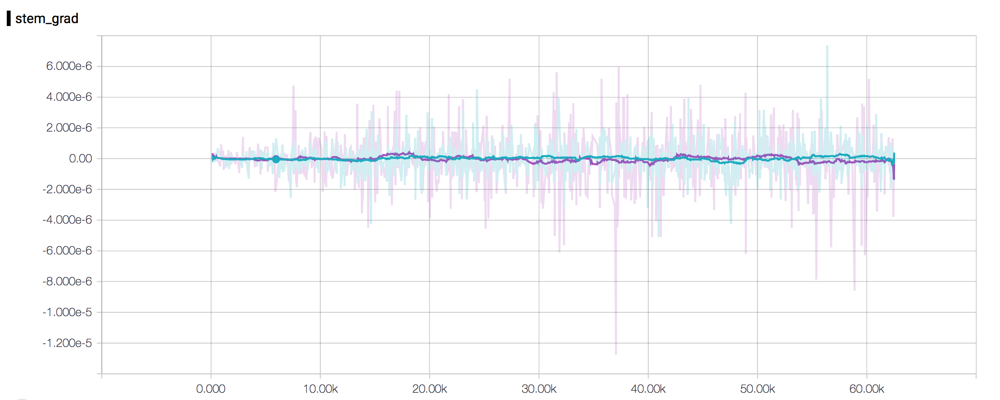
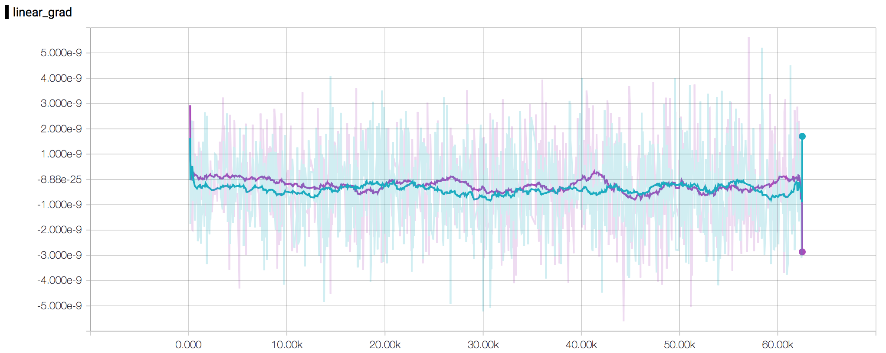
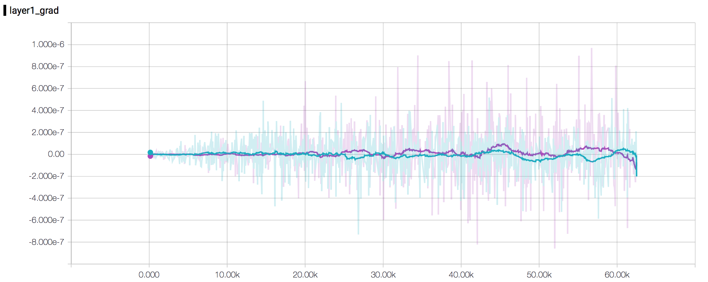
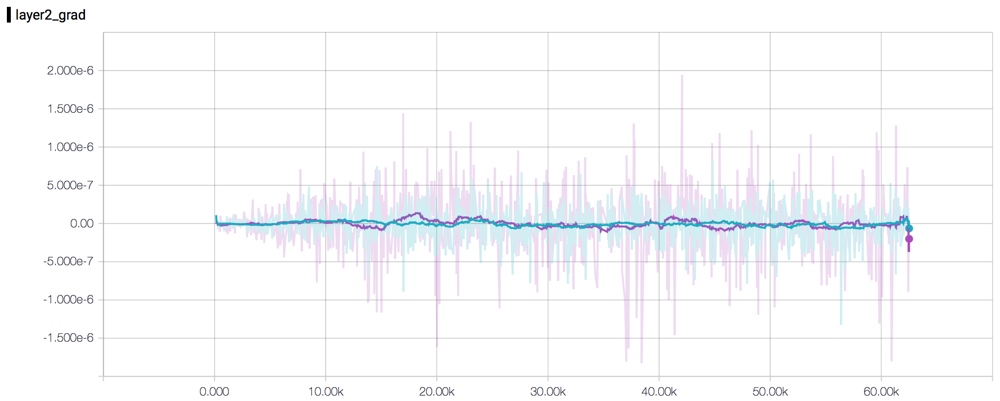
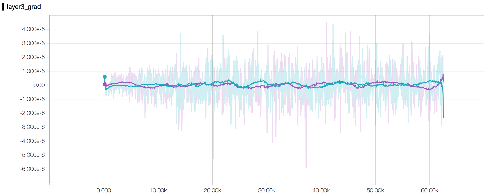
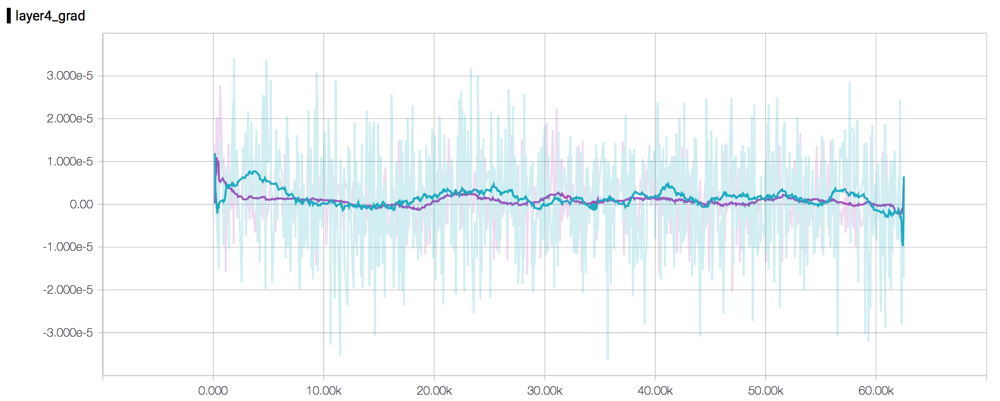

# Training ResNet-18
We trained a ResNet-18 model on the CIFAR-10 dataset using pytorch. We tested two 
rates for learning rate decay and observed the overall learning rate matters less than
the learning rate schedule. If the learning rate decays properly, then the network will
train to significantly different levels after 5 epochs. Unfortunately due to time
constraints we were not able to test more sophisticated rate decay algorithms, and so we
used a simple multiplier as detailed in the text.

## Model
Since `pytorch` conveniently provides a ResNet-18 model through its CV-oriented package 
`torchvision` we first tried to use that. The only problem is that this particular ResNet
model is set up for the ImageNet dataset, and as such uses convolution and downsampling
layers that are too aggressive for the comparatively small CIFAR-10 dataset. In
order to address this issue, we use the base layers for ResNet - the blocks that
contain the residual connections - in conjunction with a different 'stem' and final
linear layer.

The model has the following structure:
```
Block (inplanes, planes, stride)
    nn.Conv2d(inplanes, planes, 
            (fh, fw) = (3, 3), stride=stride, padding = 1, bias = False)
    nn.BatchNorm2d(planes)
    nn.ReLU(inplace = True)
    nn.Conv2d(planes, planes, 
            (fh, fw) = (3, 3), stride=1, padding = 1, bias = False)
    nn.BatchNorm2d(planes)
    
    if stride != 1:  # get residual downsample iff stride != 1
        nn.Conv2d(inplanes, planes, 
            (fh, fw) = (1, 2), stride=stride, bias = False)
        nn.BatchNorm2d(planes)
        # Add the output of this to the output of the other part (this is the
        # residual)
        
########## Net Structure ###############
        
Stem (nn.Sequential)
    nn.Conv2d(3, 64, (fh, fw) = (3, 3), padding = 1, bias = False)
    nn.BatchNorm2d(64)
    nn.ReLU(inplace = True)
    
Layer 1 (nn.Sequential)
(0)
    Block(3, 64, 1)
(1)
    Block(64, 64, 1)
    
Layer 2 (nn.Sequential)
(0)
    Block(64, 128, 2)
(1)
    Block(128, 128, 2)
    
Layer 3 (nn.Sequential)
(0)
    Block(128, 256, 2)
(1)
    Block(256, 256, 2)
    
Layer 4 (nn.Sequential)
(0)
    Block(256, 512, 2)
(1)
    Block(512, 512, 2)
    
Linear
    nn.Linear(512, 10)
    
Loss
    nn.CrossEntropyLoss()
```

As we can see, the stem had to be changed (the ImageNet stem has MaxPool layers and
downsampling in the convolution) and the final layer needed to be changed as well 
(clearly we don't need 1000 outputs for CIFAR-10).

In order to register the gradients at each layer (`Stem`, `Layer 1-4`, and `Linear`) 
we use `pytorch's` convenient `register_backward_hook` and the `tensorboard_logger` 
library to log the value of the gradient every 25 steps. The `tensorboard_logger`
library states that its `log_value` call is slow - taking 0.1-0.2 ms - which
means we must balance faster training with accurate smooth data. We find
that logging both loss and the gradients every 25 steps is a reasonable trade-off
between smooth data and faster training.

## Training
We used the `Adam` optimizer provided by `pytorch` with a weight decay of `1e-5`. 
The weight decay was selected to be small but nonzero simply because of the author's
previous experience - nets tend to generalize better with some weight decay. In
addition, the author has previously worked extensively with the `dlib` framework
whose DNN trainer uses learning rate decay. When using `dlib`, it is customary
to terminate training based on the learning rate, when it has reached some value
(usually around `1e-7`, or smaller), then the training loop terminates. The
downside is that such a termination precludes seeing the results of training with
different decay rates because one is unable to compare equally across step intervals.
Thus in this work, we use learning rate (LR) decay, but we use an epoch-based termination
scheme to extract relationships between the network's final performance and the 
rate of LR decay.

The general training scheme is as follows (some code omitted for brevity):
```python
current_lr = starting_lr  # starting_lr = 1e-3
optimizer = optim.Adam(net.parameters(), current_lr, weight_decay=weight_decay)
accumulated_loss = []

net.train()

for epoch in epochs:
    running_loss = 0.0
    for i, data_point in enumerate(train_dataset, 0):
        inputs, labels = data
        inputs = Variable(inputs).cuda()
        labels = Variable(labels).cuda()
        if i % 25 == 24:
            # Log gradients, loss
            
        optimizer.zero_grad()
        outputs = net(inputs)
        loss = criterion(outputs, labels)
        loss.backward()
        optimizer.step()

        running_loss += loss.data[0]
        accumulated_loss.append(loss.data[0])
        
        if i % k == k-1:  # k = 1000
            print('[%d, %5d] avg loss: %.3f' % (epoch + 1, i + 1, running_loss / k))
            conf_mat, accuracy = calc_confusion_matrix(net, test_dataset)

            # Print per-class accuracy

            # Plot confusion matrix to file

            # Adjust the learning rate
            # We tried values of the multiplier {0.2, 0.5}, here 0.5.
            if np.abs(np.mean(np.diff(np.array(accumulated_loss)))) <= 0.5 * current_lr:

                current_lr = np.max([current_lr * 1e-1, ending_lr])  # ending_lr = 1e-6

                log_value("LR", current_lr, step=current_step)
                optimizer = optim.Adam(net.parameters(), current_lr, weight_decay=weight_decay)
                accumulated_loss.clear()

            running_loss = 0.0
```
We set the learning rate decay based on a criterion that simply requires the mean of the gradient
of the accumulated loss to be less than half the current learning rate. As we will discuss later,
this may be a little naive but has shown to be effective in other situations nonetheless.

We set the confusion matrices to output every 1000 iterations. The confusion matrices
are generated by performing the following code:
```python
def calc_confusion_matrix(net, test_dataset):

    confusion_matrix = torch.zeros(10, 10)
    net.train(False)
    net.cuda()

    for i, data in enumerate(test_dataset, int(0.98 * len(test_dataset))):  # Test 50 examples (~5 per class)
        inputs, labels = data
        inputs = Variable(inputs).cuda()
        labels = Variable(labels).cuda()

        outputs = net(inputs)

        for j in range(labels.size()[0]):
            confusion_matrix[labels.data[j]] += outputs[j].squeeze().cpu().data

    net.train(True)

    for i in range(10):
        confusion_matrix[i] = softmax(Variable(confusion_matrix[i])).data  # normalize the confusion matrix rows

    error = np.diagonal(np.abs(np.eye(10) - confusion_matrix.cpu().numpy()))

    return confusion_matrix.numpy(), error
```
Note that we compute accuracy per class by subtracting confusion matrix from the identity and 
taking the diagonal, which is actually the error. Thus to get the accuracy, we must take 1.0 - error.

## Results
### Learning Rate Decay
The most important training metric here is actually the learning rate. As we can see from this first
plot, the learning rate for the purple run (LR multiplier = 0.5) decreased much slower than it did for the 
blue (LR multiplier = 0.2) run. Another partial run was completed with the LR multipler = 0.5 where the LR
decreased much more quickly, but that run terminated unexpectedly about halfway through. Preliminary results
were not promising, however.



We can see the effects of this in the loss; the blue did not reach the level of overall accuracy that the 
purple did.



This would suggest that the schedule behind learning rate decay is much more important that it seems
initially, and more care should be taken to create a more robust decay scheme. In the future it may
be prudent to schedule learning rate decay based on parameters internal to the optimizer, in the case
of the Adam routine, a prudent parameter would be either of the gradient moments, perhaps.

### Gradients
The gradients were interesting for a couple reasons. The first is that the trends mentioned here
did not depend strongly on the learning rate decay multiplier - though they did depend on the learning
rate itself. Perhaps this is obvious, but it means that a higher learning rate makes for larger
gradients which seems to make for faster learning, up to a point (at this point we need to lower
the learning rate so that we don't skip across a valley in the parameter space).

Another interesting observation to note is that the magnitudes seemed to increase towards
the output side of the network. This is especially evident if we compare the gradients in the stem
with the gradients in the linear layer.




This is likely because the gradients are generated at the output of the network, and so their magnitude
is closer to zero the further forward in the network we are. This suggests that further improvements
in training speed could possibly be had by multiplying the learning rate by some positive number
in layers further forward in the network. This scheme would likely benefit from the use of some sort of
scheduling algorithm, one that should likely be based on the learning rate itself.

Finally, another interesting trend to note is that the gradients actually increased in magnitude
towards the end of the optimization. This would suggest that the optimal point in the parameter space
is quite sharp - that is, we were optimizing towards a point that is unstable in the input variables.
The effect is especially visible in the gradients from Layers 1 and 2:






This is fine for our purposes, optimizing to predict the class of an image from a particular dataset,
but this is far from optimal if we want to use our network to perform other inferences. Of course,
this is speculation because we can never truly map out the parameter space. We would have to perform
further experiments on the generalizability of the network to give a conclusive answer to this
question.

## Conclusion
We conclude with the following messages. We know that the LR decay is an extremely important part
of the training procedure, and will approach it with more delicacy and perform further
experiments to optimize the scheduling process. We also note that the gradients decay as they
pass forward in a network, and it may be advantageous to the training process to have some
positive multiplier for the learning rate in a network's earlier layers. Overall, there are
many improvements to make and we look forward to conducting further experimentation.


